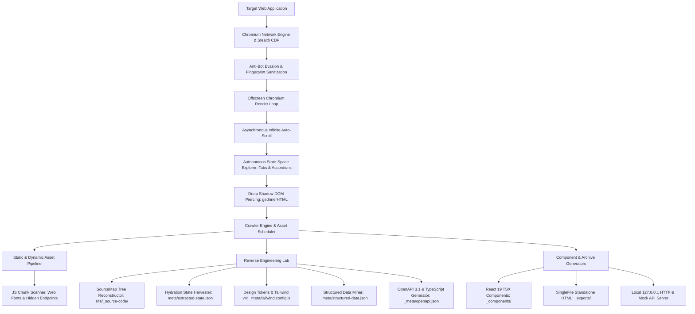
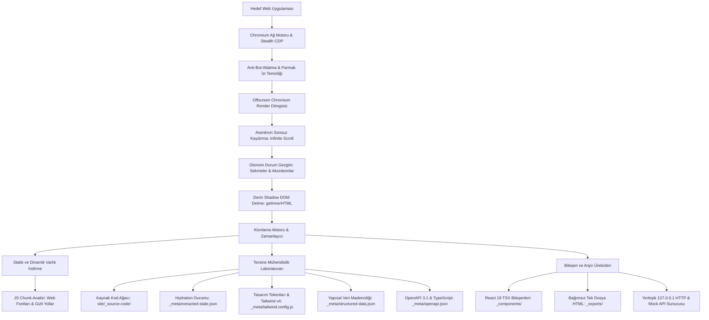

# WebClone Studio

<div align="center">

**Enterprise Web Architecture Extraction, Lossless Offline Mirroring & Reverse Engineering Workstation**

[](https://github.com/MonarchDevLab/WebClone-Studio/releases)
[](https://github.com/MonarchDevLab/WebClone-Studio/releases/latest)
[-3B82F6.svg?style=flat-square)](#)
[](#)
[](#)
[](#)
[](#)
[](#)
[](https://github.com/MonarchDevLab/WebClone-Studio/stargazers)
[](https://github.com/MonarchDevLab/WebClone-Studio)

*Developed by Monolith Works | Published via MonarchDevLab*

<br/>

[ **English Documentation** ](#english-documentation) &nbsp;&bull;&nbsp; [ **Türkçe Dokümantasyon** ](#türkçe-dokümantasyon)

</div>

---

# English Documentation

## Table of Contents
- [Executive Overview](#executive-overview)
- [Architecture & Engine Pipeline](#architecture--engine-pipeline)
- [Deep Technical Capabilities](#deep-technical-capabilities)
  - [1. Autonomous State-Space Explorer](#1-autonomous-state-space-explorer)
  - [2. Declarative Shadow DOM Piercing](#2-declarative-shadow-dom-piercing)
  - [3. Frontend Reverse Engineering Lab](#3-frontend-reverse-engineering-lab)
  - [4. API Traffic Interception to OpenAPI 3.1 & TypeScript](#4-api-traffic-interception-to-openapi-31--typescript)
  - [5. React 19 Component Exporter](#5-react-19-component-exporter)
  - [6. SingleFile Standalone Portable HTML Exporter](#6-singlefile-standalone-portable-html-exporter)
  - [7. JavaScript Obfuscation Bypass](#7-javascript-obfuscation-bypass)
  - [8. Embedded 127.0.0.1 Micro-Preview & Mock Server](#8-embedded-127001-micro-preview--mock-server)
  - [9. GitHub Releases Auto-Update Hub](#9-github-releases-auto-update-hub)
- [Workstation Benchmark & Comparison](#workstation-benchmark--comparison)
- [Distribution Formats & Installation](#distribution-formats--installation)
- [Developer Setup & Build Commands](#developer-setup--build-commands)
- [Legal & Copyright](#legal--copyright)

---

## Executive Overview

**WebClone Studio** is an enterprise-grade desktop workstation designed for web architects, reverse engineers, security analysts, and senior frontend developers. Rather than merely downloading static assets like legacy crawlers, WebClone Studio operates as an autonomous digital reconstruction laboratory:

1. **Complete Offline Mirroring:** Crawls, resolves, and rewrites complex Single Page Applications (Next.js, Nuxt, Remix, Vite, Angular) and multi-page portals for 100% offline fidelity.
2. **Reverse Engineering Decompilation:** Reconstructs original development file trees from production source maps, extracts hydration states, outputs W3C design tokens and Tailwind v4 themes, and generates OpenAPI 3.1 specifications from background network traffic.
3. **Modular Code Generation:** Synthesizes production-ready React 19 TSX components and creates self-contained single-file HTML deliverables.
4. **Native Zero-Driver Architecture:** Embeds Chromium offscreen rendering directly within Electron 33, eliminating any requirement for external browser binaries (Playwright, Puppeteer, Selenium).

---

## Architecture & Engine Pipeline

The system is organized around a multi-stage cognitive extraction pipeline:



---

## Deep Technical Capabilities

### 1. Autonomous State-Space Explorer
Traditional scrapers only capture the initial DOM state, missing up to 70% of modern dynamic interfaces. WebClone Studio executes an autonomous interaction loop:
- **Heuristic Safe Interaction:** Scans the active DOM for unopened accordions, hidden FAQ panels, unselected tabs, and expandable menus (`[role="tab"][aria-selected="false"]`, `details:not([open]) > summary`, `[aria-expanded="false"]`, `.accordion-header`, `.faq-question`).
- **Destructive Action Isolation:** Forms, submit buttons, delete/logout triggers, and external navigation links (`<a>`) are strictly filtered out to prevent state mutation or page divergence.
- **Micro-Debounced Clicks:** Sequentially simulates native user click events with debounced intervals to allow CSS transitions and dynamic lazy-loaded contents to fully populate the DOM before snapshot capture.

### 2. Declarative Shadow DOM Piercing
Web components built with Stencil, Lit, or native Custom Elements encapsulate their DOM within Shadow Roots, leaving standard `outerHTML` dumps empty:
- **Chromium Native Serialization:** Leverages `element.getInnerHTML({ includeShadowRoots: true })` directly within Electron Chromium 130.
- **W3C Declarative Format:** Serializes nested shadow trees into standard `<template shadowrootmode="open">` elements, enabling any modern Chromium browser to render encapsulated components offline with zero JavaScript overhead.

### 3. Frontend Reverse Engineering Lab
- **SourceMap Virtual Tree Reconstructor:** Scans all JS and CSS bundles for `sourceMappingURL` directives (relative, absolute, or data URIs). It resolves and decodes `.map` files, reconstructing the original developer file hierarchy inside `site/_source-code/` (e.g. `src/components/Button.tsx`, `src/hooks/useCart.ts`).
- **Framework Hydration Harvester:** Captures server-rendered hydration state containers including `window.__NEXT_DATA__`, `window.__NUXT_DATA__`, `window.__INITIAL_STATE__`, and Apollo/Redux preloaded caches, outputting a consolidated dataset into `_meta/extracted-state.json`.
- **Design Tokens & Tailwind v4 Theme:** Aggregates `:root` CSS variables, active computed colors, typography scales, border radii, and box shadows. Generates ready-to-use W3C Design Tokens (`_meta/design-tokens.json`) and an idiomatic Tailwind CSS v4 `@theme` configuration (`_meta/tailwind.config.js`).
- **Structured Data Mining:** Scans repetitive DOM structures (grids, product lists, article feeds) using Cheerio heuristic clustering. Outputs structured JSON collections containing titles, links, images, prices, and descriptions (`_meta/structured-data.json`).

### 4. API Traffic Interception to OpenAPI 3.1 & TypeScript
- **CDP Network Hooking:** Connects to Chrome DevTools Protocol (`Network.enable`) to capture all background asynchronous requests (XHR, Fetch, JSON responses).
- **OpenAPI 3.1 Contract Generation:** Infers JSON schemas, request query parameters, and HTTP response statuses to compile a production-ready `_meta/openapi.json` (Swagger) contract.
- **TypeScript Type Definitions:** Compiles strongly typed TypeScript interfaces for each endpoint into `_meta/api-types.d.ts`. Example output:

```typescript
/**
 * Endpoint: GET /api/v1/products
 * Status: 200
 */
export interface GetApiV1ProductsResponse {
  products?: { id?: number; title?: string; price?: number; inStock?: boolean }[];
  totalCount?: number;
  page?: number;
}
```

### 5. React 19 Component Exporter
- Converts cloned HTML pages into clean, modular React functional components (`_components/Page_*.tsx`).
- Converts HTML attributes (`class` to `className`, `for` to `htmlFor`).
- Translates inline style strings into valid TypeScript style objects (`style="margin-top: 10px; z-index: 5;"` -> `style={{ marginTop: '10px', zIndex: 5 }}`).
- Translates SVG attributes to camelCase (`stroke-width` -> `strokeWidth`, `fill-rule` -> `fillRule`).
- Formats self-closing tags (``, `<input>`, `<br>`, `<hr>`).

### 6. SingleFile Standalone Portable HTML Exporter
- Packages the entire mirrored page into an all-in-one standalone file (`_exports/index.standalone.html`).
- Inlines stylesheets (`<link rel="stylesheet">` -> `<style>`).
- Encodes font files (`.woff2`, `.ttf`) inside CSS into Base64 Data URIs (`url("data:font/woff2;base64,...")`).
- Converts images, logos, and icons into Base64 Data URIs.
- Eliminates the need for a web server when sharing landing pages or archival records via email or Slack.

### 7. JavaScript Obfuscation Bypass
- Heuristic AST and regex parser scans minified production JS chunks (Webpack, Vite, Rollup).
- Extracts dynamic asset paths, vendor CDN URLs, and hidden web font endpoints that are never linked directly in HTML or CSS.
- Automatically pushes discovered assets into the download scheduler queue.

### 8. Embedded 127.0.0.1 Micro-Preview & Mock Server
- Bundles a built-in Node.js HTTP server configured with path-traversal guards and MIME type negotiation.
- Serves cloned projects locally over `http://127.0.0.1:<port>` to eliminate browser `file:///` security and CORS errors.
- **Offline API Mock Fallback:** When the cloned frontend makes an AJAX request that has no static file on disk, the server falls back to `_meta/api-endpoints.json` to respond with the recorded JSON payload, keeping search and filter UI functional offline.

### 9. GitHub Releases Auto-Update Hub
- Built-in update service queries the official GitHub Releases API (`https://api.github.com/repos/MonarchDevLab/WebClone-Studio/releases/latest`).
- In-app Settings page displays current version, latest release notes, total download counters, and direct download links for Windows Setup, Portable, and MSI installers.

---

## Workstation Benchmark & Comparison

| Feature / Capability | WebClone Studio | HTTrack | SingleFile | Cyotek WebCopy | Raw Puppeteer Scripts |
| :--- | :---: | :---: | :---: | :---: | :---: |
| **Shadow DOM Piercing** | Full (Native CDP) | No | Partial | No | Manual script required |
| **Autonomous State Explorer** | Built-in | No | No | No | Manual script required |
| **SourceMap Reconstruction** | Automatic | No | No | No | No |
| **OpenAPI 3.1 & TS Generator** | Built-in | No | No | No | No |
| **React 19 Component Export** | Automatic | No | No | No | No |
| **Hydration State Recovery** | Built-in | No | No | No | No |
| **Tailwind v4 Token Generator** | Built-in | No | No | No | No |
| **Offline Mock API Server** | 127.0.0.1 Built-in | No | No | No | External server needed |
| **Single-File Standalone Export**| Yes (`_exports/`) | No | Yes | No | Manual inlining |
| **External Driver Dependency** | Zero (Embedded) | None | None | None | Heavy (Chromium/Node) |
| **Distribution Formats** | Setup, Portable, MSI | Setup | Extension | Setup | CLI script only |

---

## Distribution Formats & Installation

WebClone Studio releases provide three Windows x64 distribution packages:

```
dist/
├── WebClone-Studio-Setup-1.0.0.exe    # NSIS installer with desktop shortcuts and uninstaller (~77.9 MB)
├── WebClone-Studio-Portable.exe       # Standalone portable executable. Zero installation (~77.6 MB)
└── WebClone-Studio-1.0.0.msi          # Microsoft Windows Installer for enterprise GPO deployment (~97.2 MB)
```

1. **Portable Edition:** Download `WebClone-Studio-Portable.exe`, place it in any folder or USB drive, and double-click to run. Requires no administrative privileges.
2. **Setup Installer:** Run `WebClone-Studio-Setup-1.0.0.exe` for standard Windows installation with Start Menu and Desktop shortcuts.
3. **MSI Package:** Suitable for enterprise system administrators deploying across domain networks via Microsoft Intune or Group Policy.

---

## Developer Setup & Build Commands

```bash
# Clone repository
git clone https://github.com/MonarchDevLab/WebClone-Studio.git
cd WebClone-Studio

# Install production and development dependencies
npm install

# Run desktop app in development mode with HMR
npm run dev

# Run strict TypeScript type verification
npm run typecheck

# Run unit and integration tests
npm test

# Build production bundles
npm run build

# Package portable Windows binary only
npm run build:portable

# Package NSIS setup installer only
npm run build:setup

# Package MSI Windows Installer only
npm run build:msi

# Package all Windows targets simultaneously (Setup, Portable, MSI)
npm run build:all
```

---

<br/>

# Türkçe Dokümantasyon

## İçindekiler
- [Genel Bakış](#genel-bakış-1)
- [Mimari ve Motor Boru Hattı](#mimari-ve-motor-boru-hattı)
- [Derinlemesine Teknik Yetenekler](#derinlemesine-teknik-yetenekler)
  - [1. Otonom Durum Gezgini (State Explorer)](#1-otonom-durum-gezgini-state-explorer-1)
  - [2. Declarative Shadow DOM Delme](#2-declarative-shadow-dom-delme)
  - [3. Tersine Mühendislik ve Dekompilasyon Laboratuvarı](#3-tersine-mühendislik-ve-dekompilasyon-laboratuvarı)
  - [4. Ağ Trafiğinden OpenAPI 3.1 ve TypeScript Üretimi](#4-ağ-trafiğinden-openapi-31-ve-typescript-üretimi)
  - [5. React 19 Fonksiyonel Bileşen İhracı](#5-react-19-fonksiyonel-bileşen-ihracı)
  - [6. Bağımsız Tek Dosya Arşivleyici (SingleFile)](#6-bağımsız-tek-dosya-arşivleyici-singlefile-1)
  - [7. JavaScript Obfuscation Bypass (Gizli Varlık Çıkarımı)](#7-javascript-obfuscation-bypass-gizli-varlık-çıkarımı)
  - [8. Yerleşik 127.0.0.1 Önizleme ve Çevrimdışı Mock Sunucusu](#8-yerleşik-127001-önizleme-ve-çevrimdışı-mock-sunucusu)
  - [9. GitHub Releases Güncelleme Merkezi](#9-github-releases-güncelleme-merkezi-1)
- [Karşılaştırma ve Başarım Tablosu](#karşılaştırma-ve-başarım-tablosu)
- [Kurulum ve Paket Seçenekleri](#kurulum-ve-paket-seçenekleri-1)
- [Geliştirici Kılavuzu ve Komutlar](#geliştirici-kılavuzu-ve-komutlar)
- [Telif Hakları ve Mülkiyet](#telif-hakları-ve-mülkiyet)

---

## Genel Bakış

**WebClone Studio**, web mimarları, tersine mühendislik uzmanları, güvenlik araştırmacıları ve kıdemli frontend geliştiricileri için sıfırdan inşa edilmiş kurumsal düzeyde bir masaüstü çalışma istasyonudur. Geleneksel klonlama yazılımlarının aksine, modern web uygulamalarını yalnızca indirmez; onları eksiksiz bir dijital rekonstrüksiyon sürecinden geçirir:

1. **Kayıpsız Çevrimdışı Klonlama:** Modern SPA (Next.js, Nuxt, Remix, Vite, Angular) ve geleneksel çok sayfalı portalları %100 çevrimdışı sadakatle yerel dosya sistemine aktarır.
2. **Tersine Mühendislik ve Dekompilasyon:** Canlı sitelerdeki kaynak haritalarından (source maps) orijinal kaynak kod ağacını (`site/_source-code/`) kurtarır; hydration durumlarını, W3C tasarım tokenlarını ve ağ trafiğinden OpenAPI 3.1 spesifikasyonunu üretir.
3. **Modüler Kod Üretimi:** Klonlanan sayfaları temiz React 19 TSX bileşenlerine dönüştürür ve dağıtılabilir tek parça bağımsız HTML çıktıları oluşturur.
4. **Sıfır Harici Sürücü Bağımlılığı:** Electron 33'ün yerleşik offscreen Chromium motorunu kullanır. Playwright, Puppeteer veya harici WebDriver kurulumu gerektirmez.

---

## Mimari ve Motor Boru Hattı

Sistem, çok aşamalı otonom bir analiz ve çıkarma boru hattı üzerine kuruludur:



---

## Derinlemesine Teknik Yetenekler

### 1. Otonom Durum Gezgini (State Explorer)
Geleneksel tarayıcılar sayfanın yalnızca ilk halini dondurur ve gizli akordeonların, sekmelerin veya dinamik menülerin %70'ini kaçırır. WebClone Studio otonom etkileşim döngüsüyle bu sorunu çözer:
- **Güvenli Seçici Analizi:** Sayfadaki kapalı akordeonları, seçilmemiş sekmeleri ve katlanmış blokları otomatik haritalandırır (`[role="tab"][aria-selected="false"]`, `details:not([open]) > summary`, `[aria-expanded="false"]`, `.accordion-header`, `.faq-question`).
- **Tehlikeli Eylemlerin İzolasyonu:** Formlar, gönderim (submit) butonları, oturum kapatma ve harici yönlendirme linkleri (`<a>`) filtre dışı tutulur; böylece oturum ve sayfa bütünlüğü korunur.
- **Debounce Destekli Simülasyon:** Tıklama olayları sıralı ve gecikmeli olarak tetiklenerek CSS animasyonlarının ve dinamik içeriklerin DOM'a tam yerleşmesi sağlanır.

### 2. Declarative Shadow DOM Delme
Modern web bileşenleri (Web Components, Lit, Stencil) içeriklerini Shadow Root içine hapsederek standart DOM kopyalamasını engeller:
- **Chromium Seviyesinde Ayrıştırma:** Electron Chromium 130 motorunun `getInnerHTML({ includeShadowRoots: true })` kabiliyeti devreye sokulur.
- **W3C Declarative Standart Formatı:** Gizli shadow ağaçları `<template shadowrootmode="open">` etiketlerine dönüştürülerek kaydedilir. Bu sayede tüm Chromium tarayıcılar bileşenleri hiçbir harici JavaScript çalışmasa bile çevrimdışı render edebilir.

### 3. Tersine Mühendislik ve Dekompilasyon Laboratuvarı
- **SourceMap Kaynak Kod Ağacı Kurtarma:** JS ve CSS paketlerindeki `sourceMappingURL` direktiflerini izler. `.map` dosyalarını çözerek projenin geliştirme aşamasındaki orijinal klasör hiyerarşisini `site/_source-code/` altında birebir oluşturur (örn. `src/components/Navbar.tsx`, `src/hooks/useCart.ts`).
- **Framework Hydration Durum Toplama:** SSR/SPA sayfalarında bulunan `window.__NEXT_DATA__`, `window.__NUXT_DATA__`, `window.__INITIAL_STATE__` ve Redux/Apollo önbelleklerini ayıklayıp tek bir `_meta/extracted-state.json` dosyasında birleştirir.
- **Tasarım Sistemi & Tailwind v4 Teması:** Canlı stillerdeki `:root` CSS değişkenlerini, hesaplanmış renk skalalarını ve font ailelerini çıkarır. W3C Design Tokens standart dosyasını (`_meta/design-tokens.json`) ve kullanıma hazır Tailwind CSS v4 `@theme` yapılandırmasını (`_meta/tailwind.config.js`) üretir.
- **Yapısal Veri Madenciliği:** Sayfadaki tekrarlayan ürün listelerini, makale kartlarını ve veri tablolarını Cheerio tabanlı kümeleme algoritmalarıyla tarayarak temiz `_meta/structured-data.json` nesnelerine dönüştürür.

### 4. Ağ Trafiğinden OpenAPI 3.1 ve TypeScript Üretimi
- **CDP Ağ Yakalama:** Chrome DevTools Protocol (`Network.enable`) üzerinden arka planda gerçekleşen tüm dinamik XHR, Fetch ve JSON isteklerini kaydeder.
- **OpenAPI 3.1 Sözleşmesi:** İstek parametrelerini ve yanıt gövdelerini JSON şema analizinden geçirerek eksiksiz bir `_meta/openapi.json` (Swagger) spesifikasyonu oluşturur.
- **TypeScript Model Üretimi:** Her uç nokta için tip güvenli TypeScript interface yapıları derler (`_meta/api-types.d.ts`). Örnek çıktı:

```typescript
/**
 * Endpoint: GET /api/v1/products
 * Status: 200
 */
export interface GetApiV1ProductsResponse {
  products?: { id?: number; title?: string; price?: number; inStock?: boolean }[];
  totalCount?: number;
  page?: number;
}
```

### 5. React 19 Fonksiyonel Bileşen İhracı
- Klonlanan HTML sayfalarını modern, tipli React fonksiyonel bileşenlerine (`_components/Page_*.tsx`) çevirir.
- `class` -> `className`, `for` -> `htmlFor` nitelik dönüşümlerini uygular.
- Satır içi stil metinlerini (`style="color: red; margin-top: 8px;"`) React stil nesnelerine (`style={{ color: 'red', marginTop: '8px' }}`) dönüştürür.
- SVG niteliklerini camelCase formatına çevirir (`stroke-width` -> `strokeWidth`).
- Kapanmayan etiketleri (``, `<input>`, `<br>`) JSX standartlarına uygun şekilde kapatır.

### 6. Bağımsız Tek Dosya Arşivleyici (SingleFile)
- Klonlanan sayfayı harici klasör ve dosya ihtiyacı olmaksızın tek bir bağımsız `.html` dosyasında toplar (`_exports/index.standalone.html`).
- Stilleri `<style>` bloklarına dönüştürür.
- Font dosyalarını (`.woff2`, `.ttf`) ve görselleri Base64 Data URI olarak kodlar.
- Çevrimdışı sayfaları e-posta veya Slack üzerinden tek tıkla paylaşılabilir hale getirir.

### 7. JavaScript Obfuscation Bypass (Gizli Varlık Çıkarımı)
- Minify edilmiş JS chunk'larını (Webpack, Vite, Rollup) statik regex ve AST desenleriyle analiz eder.
- HTML veya CSS dosyalarında açıkça belirtilmeyen gizli web fontlarını, arka plan görsellerini ve dinamik asset yollarını keşfederek indirme kuyruğuna otomatik dahil eder.

### 8. Yerleşik 127.0.0.1 Önizleme ve Çevrimdışı Mock Sunucusu
- Güvenli yol denetimine (path-traversal protection) ve dinamik MIME eşlemesine sahip yerleşik Node.js HTTP sunucusu barındırır.
- Klonlanan projeleri yerel porttan sunarak tarayıcı `file:///` güvenlik engellerini ve CORS hatalarını ortadan kaldırır.
- **Çevrimdışı Dinamik API Yanıtı:** Sayfa üzerinde yapılan bir API çağrısı yerel diskte statik bir dosya bulamazsa, sunucu otomatik olarak `_meta/api-endpoints.json` veritabanından yakalanan yanıtı döner; böylece arama ve filtreleme özellikleri internet olmadan da çalışır.

### 9. GitHub Releases Güncelleme Merkezi
- Uygulama içi Ayarlar menüsünden resmi GitHub API'sini sorgulayarak yeni sürüm kontrolü yapar.
- Canlı indirme sayaçlarını, sürüm notlarını ve Setup, Portable ve MSI formatlarındaki yükleme paketlerinin doğrudan indirme butonlarını sunar.

---

## Karşılaştırma ve Başarım Tablosu

| Özellik / Yetenek | WebClone Studio | HTTrack | SingleFile | Cyotek WebCopy | Saf Puppeteer Kodları |
| :--- | :---: | :---: | :---: | :---: | :---: |
| **Shadow DOM Delme** | Tam (Native CDP) | Yok | Kısmi | Yok | Manuel betik gerektirir |
| **Otonom Durum Gezgini** | Yerleşik | Yok | Yok | Yok | Manuel betik gerektirir |
| **SourceMap Kaynak Kurtarma**| Otomatik | Yok | Yok | Yok | Yok |
| **OpenAPI 3.1 & TS Üretimi** | Yerleşik | Yok | Yok | Yok | Yok |
| **React 19 Bileşen İhracı** | Otomatik | Yok | Yok | Yok | Yok |
| **Hydration Durum Toplama** | Yerleşik | Yok | Yok | Yok | Yok |
| **Tailwind v4 Token Üretimi** | Yerleşik | Yok | Yok | Yok | Yok |
| **Çevrimdışı Mock Sunucusu** | 127.0.0.1 Yerleşik| Yok | Yok | Yok | Harici sunucu gerekir |
| **Tek Dosya Bağımsız Çıktı** | Var (`_exports/`) | Yok | Var | Yok | Manuel Base64 kodlama |
| **Harici Sürücü İhtiyacı** | Sıfır (Yerleşik) | Yok | Yok | Yok | Yüksek (Chromium/Node) |
| **Dağıtım Paketleri** | Setup, Portable, MSI| Setup | Tarayıcı Eklentisi| Setup | Yalnızca CLI betiği |

---

## Kurulum ve Paket Seçenekleri

WebClone Studio sürümleri üç farklı Windows x64 kurulum seçeneğiyle dağıtılır:

```
dist/
├── WebClone-Studio-Setup-1.0.0.exe    # Masaüstü ve başlat menüsü kısayollarını içeren NSIS kurulumu (~77.9 MB)
├── WebClone-Studio-Portable.exe       # Kurulum gerektirmeyen tek parça bağımsız çalıştırılabilir dosya (~77.6 MB)
└── WebClone-Studio-1.0.0.msi          # Kurumsal ağlar ve GPO dağıtımı için Microsoft Windows Installer (~97.2 MB)
```

1. **Portable Sürüm:** `WebClone-Studio-Portable.exe` dosyasını indirin, dilediğiniz bir klasöre veya USB belleğe koyarak doğrudan çalıştırın. Yönetici yetkisi gerektirmez.
2. **Setup Kurulumu:** `WebClone-Studio-Setup-1.0.0.exe` dosyasını çalıştırarak standart Windows kurulumunu tamamlayın.
3. **MSI Paketi:** Kurumsal sistem yöneticileri için Active Directory, Microsoft Intune veya Grup İlkesi (GPO) üzerinden toplu dağıtıma uygundur.

---

## Geliştirici Kılavuzu ve Komutlar

```bash
# Depoyu yerel ortama çekin
git clone https://github.com/MonarchDevLab/WebClone-Studio.git
cd WebClone-Studio

# Bağımlılıkları kurun
npm install

# HMR destekli geliştirici modunda başlatın
npm run dev

# Katı TypeScript tip denetimini çalıştırın
npm run typecheck

# Birim ve entegrasyon testlerini çalıştırın
npm test

# Üretim derlemesini tamamlayın
npm run build

# Sadece Portable Windows .exe paketini üretin
npm run build:portable

# Sadece NSIS Setup .exe kurulum paketini üretin
npm run build:setup

# Sadece MSI kurulum paketini üretin
npm run build:msi

# Tüm Windows kurulum paketlerini aynı anda derleyin (Setup, Portable, MSI)
npm run build:all
```

---

## Telif Hakları ve Mülkiyet

Bu yazılım ve tüm mimari mülkiyet hakları istisnasız **Monolith Works** kuruluşuna aittir.  
Açık kaynak ve resmi dağıtım kanalı: **MonarchDevLab**.

Lisans: **MIT License**.
